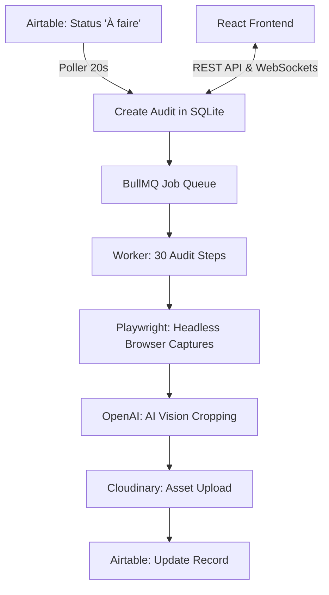

# 🔍 Smart Audit SEO — Architecture & Automation


**Smart Audit SEO** is a high-performance, fully automated SEO auditing robot built for scale. It autonomously visits client websites, captures critical SEO metrics, intelligently crops data using AI Vision, and syncs everything directly into Airtable.

---

## 🌟 Highlights & Features

This project demonstrates advanced expertise in Node.js backend orchestration, dynamic browser automation, and modern React frontend design.

- **30-Step Autonomous Audit**: Orchestrates a massive multi-step pipeline covering `robots.txt`, XML Sitemaps, SSL, PageSpeed Insights, Mobile Responsiveness, and competitive SEO tools (Ahrefs, Semrush, Majestic, Ubersuggest).
- **Intelligent Google Workspace Interaction**: Programmatically authenticates and drives Google Search Console (GSC) and Google Sheets to extract, crop, and save data tables directly.
- **AI-Powered Image Cropping**: Integrates **OpenAI GPT-4o Vision** to intelligently bounds-crop browser screenshots down to the exact data tables needed for the final report.
- **Robust Job Queuing**: Utilizes **BullMQ** (Redis) to reliably orchestrate parallel audits with automatic retries, timeouts, and asynchronous completion status.
- **Real-Time Client Updates**: Uses **Socket.io** to provide immediate, granular feedback to the React dashboard on active audit progression.
- **Automated Two-Way Sync**: Interfaces seamlessly with **Airtable** through a dedicated poller, dynamically pulling waiting tasks and continuously updating records with extracted data and Cloudinary image URLs.

---

## 🏗️ System Architecture



## 📦 Technical Stack

| Category | Technology |
|---|---|
| **Frontend** | React 19, Vite, TailwindCSS, Lucide Icons |
| **Backend** | Node.js (Express), ESM Modules |
| **Task Queue** | BullMQ, IORedis |
| **Database** | SQLite3 (Persistent Local File) |
| **Automation** | Playwright (Chromium) |
| **AI Vision** | OpenAI GPT-4o Vision API |
| **Image Processing** | Sharp, Cloudinary |
| **Integrations** | Airtable API, SSL Labs API v4, Google APIs |

## 🚀 Key Technical Challenges Solved

### Programmatic Authentication & Session Resumption
Bypassing modern CAPTCHAs and session expiration for tools like Google Search Console and My Ranking Metrics requires sophisticated handling of cookies. The backend allows encrypted cookie injection (AES-256) through the database, spinning up Playwright instances pre-authenticated without triggering anti-bot protections.

### Smart DOM Manipulation & UI Stripping
Google Sheets capture steps required hiding the native Google UI chrome (toolbars, menu items, tabs) directly via injected CSS before taking Playwright screenshots, ensuring only raw data is captured.

### AI-Driven Responsive Cropping
Hardcoding pixel sizes for screenshots fails across different devices and dynamic data lengths. Instead, the screen captures are piped to `gpt-4o`, which acts as an expert coordinate estimator. It identifies where the target table begins and ends, returning strict `x, y, width, height` commands executed by the `sharp` image library.

## ⚙️ Environment Configuration

To run the platform locally, create a `.env` file containing:

```env
# Server
PORT=3000
JWT_SECRET=your_jwt_secret
ENCRYPT_KEY=your_aes256_32bytes_key

# Redis (required for BullMQ)
REDIS_URL=redis://localhost:6379

# Cloudinary
CLOUDINARY_CLOUD_NAME=name
CLOUDINARY_API_KEY=key
CLOUDINARY_API_SECRET=secret

# OpenAI
OPENAI_API_KEY=sk-...

# Airtable
AIRTABLE_API_KEY=pat...
AIRTABLE_BASE_ID=app...
AIRTABLE_TABLE_ID=tbl...
```

## 💻 Local Quickstart

```bash
# 1. Install dependencies
npm install

# 2. Install Playwright browsers
npx playwright install chromium

# 3. Start Redis (Requirement)
docker run -d -p 6379:6379 redis

# 4. Start concurrent dev servers (Frontend & Backend)
npm run dev

# 5. Build for production equivalent
npm run build && npm start
```

---
*Created and maintained by [Flowcraft-chel](https://github.com/Flowcraft-chel).*
